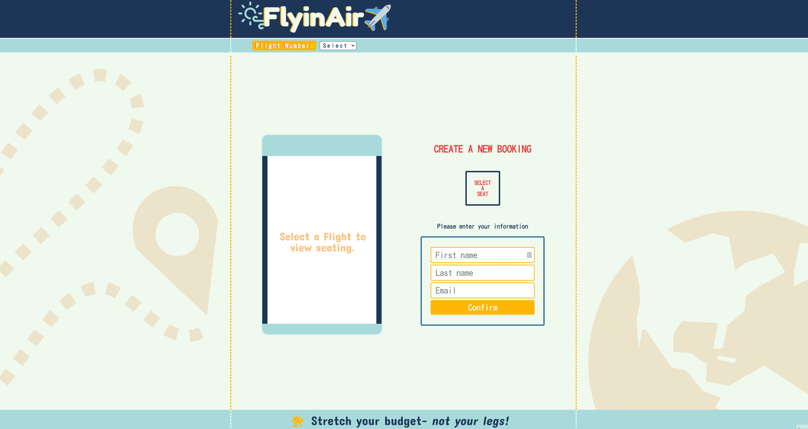

> # FLYINAIR

A basic airline booking system produced as part of the Concordia Bootcamps Full-Stack Web Development program. This was the first time I got to use MongoDB for a real project.

## Higher quality demo available on YouTube https://youtu.be/zPTrEqcQQ1A

> ##### (The original requirements of this project are detailed in full in ORIGINAL_README.md)
